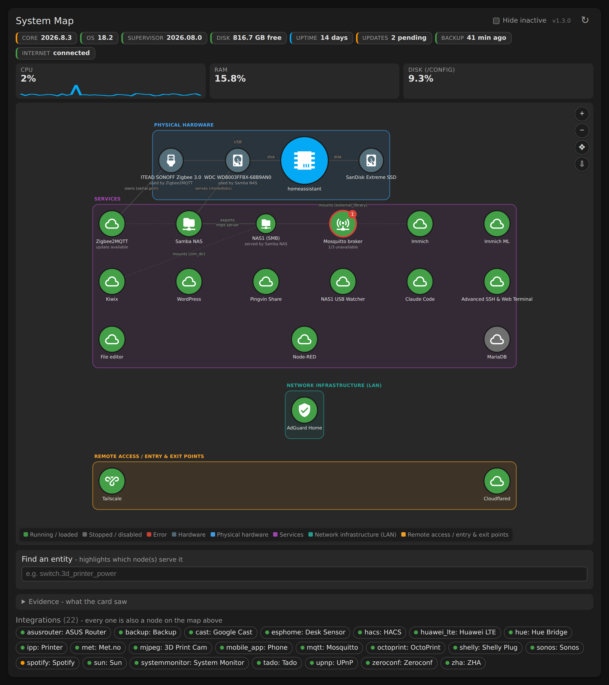

# System Map Card



A Lovelace custom card that renders a live, layered topology **and health**
map of a Home Assistant server: discovered physical hardware, which add-on
owns each piece of hardware and why, LAN network infrastructure,
remote-access entry/exit points, confirmed externally-exposed services, and
every other installed add-on and integration in auto-generated grids so
nothing is ever missing.

All data is fetched live from Home Assistant's own WebSocket API - no
backend add-on required, and no configuration necessary.

The part that makes it a monitor rather than a diagram is the joins. An
add-on can be "started" and an integration "loaded" while every entity they
serve is dead, so entity states, the repairs registry and System Health are
resolved back onto the node that owns them and drawn there as a red ring and
a count.

## Features

- Layered, colour-coded tiers (physical hardware / services using that
  hardware / network infrastructure / remote access), each drawn as a
  bounding box computed from the actual node positions
- Nothing is ever missing: below the curated tiers, every remaining add-on
  and *every* config entry is auto-laid-out into its own labelled grid, so
  each installed integration has a real node on the map
- Zoom (mouse wheel or on-screen buttons) and pan (click-drag)
- Click any node for live detail: state, version, internal port, and (where
  applicable) its public URL
- "Hide inactive" filter for stopped add-ons and disabled/ignored
  integrations
- Entity finder: search for any entity and the card highlights which
  node(s) actually serve it - in the graph and in the integrations list at
  once - resolving through helper entities (e.g. `switch_as_x`) back to
  their real source, then panning the view onto the result
- MDI icons per node
- **Status bar**: Core / OS / Supervisor versions and pending updates, disk
  free, uptime, last backup age, internet connectivity, and open repair
  issues - each colour-coded by severity and clickable for the detail behind
  it
- **Problem detection**: any node serving unavailable entities gets a red
  ring and an `n/total unavailable` count; open repair issues and System
  Health data land on the node for their domain
- **Nothing is hand-placed.** Every node, edge, tier and position is derived
  from the instance's own data, so the card is the same code on your setup as
  on anyone else's:
  - **Hardware** from Supervisor's `/hardware/info`, with ownership edges
    found by matching a device's by-id path, mount point *or filesystem
    label* against each add-on's own options - the edge is labelled with the
    option that matched, e.g. `owns (serial.port)` or `serves (moredisks)`
  - **Re-published shares are followed**: where one add-on mounts a disk and
    serves it over SMB (detected from its published ports, not its name), the
    add-ons referencing that disk are drawn downstream of the *share* rather
    than hanging off the hardware - the dependency that actually breaks when
    that add-on stops
  - **Tiers from ports**: 53 is network infrastructure, a VPN port is remote
    access, an add-on publishing hostnames for other things is a way in
  - **Service edges** from the add-ons an add-on names in its own options
    (`mqtt://core-mosquitto:1883` becomes an edge labelled `mqtt.server`)
  - **Public URLs** from the tunnel add-on that routes them, read from its
    options, or from its log when the tunnel is managed remotely and the
    rules never touch disk
  - **Exported shares as nodes**: disk → the add-on exporting it → the share
    → everything mounting it, so the chain is visible rather than implied by
    edge labels
  - **Routers** from integrations reporting `device_tracker` entities with
    `source_type: router`
  - **Positions** by a barycentre pass that keeps connected nodes near each
    other, not by hand-written coordinates
- **Live resource use**: per-add-on CPU, memory, network and disk I/O in the
  detail panel, fetched on click; optional log tail alongside it
- **Counts**: devices, entities and areas per node, from the registries
- **Host stat tiles** with one-hour sparklines from the recorder
- Optional **group-by-area** layout for the integrations grid
- **Download as PNG** - exports the whole map, not just the visible part
- A **visual editor**: every option below is settable by clicking, no YAML

## Configuration

No configuration is required - the card works with an empty config, and
every option has a sensible default. All of them are editable in the visual
editor (three-dot menu on the card -> Edit).

| Option | Default | What it does |
| --- | --- | --- |
| `title` | `System Map` | Card heading |
| `graph_height` | `480` | Height of the map area, in pixels |
| `refresh_interval` | `60` | Seconds between background refreshes; `0` disables |
| `hide_inactive` | `false` | Start with stopped/disabled things hidden |
| `tiers` | all four | Which tiers to draw |
| `show_status_bar` | `true` | The status strip along the top |
| `show_host_stats` | `true` | CPU / RAM / disk tiles |
| `show_sparklines` | `true` | One-hour history behind those tiles |
| `show_legend` | `true` | Colour key over the map |
| `show_entity_finder` | `true` | The entity search box |
| `show_addon_grid` | `true` | Auto-grid of add-ons not pinned to the map |
| `show_integration_grid` | `true` | Auto-grid of every config entry |
| `show_integration_list` | `true` | The scrollable integration chip list |
| `highlight_problems` | `true` | Unavailable-entity / repair-issue rings |
| `show_counts` | `true` | Device and entity counts on nodes |
| `discover_hardware` | `true` | Build the hardware tier from `/hardware/info` |
| `group_by_area` | `false` | Split the integrations grid by area |
| `show_addon_stats` | `true` | Live CPU/RAM in the detail panel |
| `show_addon_logs` | `false` | Log tail in the detail panel (see note below) |
| `scan_service_logs` | `false` | Read every running add-on's log for services it dials |
| `show_debug` | `false` | Evidence panel: what the card saw and concluded |
| `cpu_entity` etc. | auto | Override the host-stat entities |

```yaml
type: custom:system-map-card
title: System Map
graph_height: 600
group_by_area: true
```

### When the map is missing something

Turn on **Show the evidence panel** in the visual editor. It lists, per
add-on, the ports it publishes, the roles and tier derived from them, its
option keys, whether its log was read and every edge derived for it - plus
the external routes and what each resolved to. If an add-on shows no ports,
no matched options and no log evidence, the information genuinely isn't in
any API the card can reach, and no amount of configuration will surface it.

### A note on `show_addon_logs`

Off by default on purpose. Add-on logs can contain tokens, credentials and
other things you would not want rendered onto a dashboard that might be on a
wall tablet. Turn it on if that's not a concern for your setup.

## Requirements

The status bar, discovered hardware and per-add-on resource stats come from
the Supervisor API, so they need a Supervised or Home Assistant OS install.
On a Container/Core install those sections fail their fetch individually and
the rest of the card - the topology, the integration grids, the problem
joins and the entity finder - carries on working.

## Versioning

Releases follow [semantic versioning](https://semver.org/) and are listed in
[CHANGELOG.md](CHANGELOG.md). `VERSION` in `system-map-card.js` is the source
of truth: it's shown in the card header and logged to the browser console on
load.

**Releases are automatic.** Bump `VERSION`, add a `CHANGELOG.md` entry, and
push to `main`; the `Release` workflow runs the tests, creates the tag and
publishes the release. Nothing else to do - and because HACS installs from
releases, that's also what makes the update appear in HACS rather than
needing a manual redownload.

If a version has already been released the workflow does nothing, so ordinary
commits that don't touch `VERSION` are free. Publishing a release from the
GitHub website works too (Releases → Draft a new release → create the tag on
publish); the workflow attaches the card to it. A tag pushed by hand is
checked against `VERSION` and refused if the two disagree.

## Development

```
node test/system-map-card.test.mjs      # 58 assertions, no dependencies
```

No build step: the card is evaluated against a stubbed DOM, covering config
defaulting, hardware discovery and its derived edges, the problem and count
joins, the status-bar thresholds, the emitted markup, and that every optional
section can be switched off without taking the card down.

To regenerate the screenshot above against fixture data:

```
npm install --no-save playwright
npx playwright install chromium   # or set PLAYWRIGHT_CHROMIUM_PATH
node tools/screenshot.mjs
```

## Install via HACS

1. HACS → the three-dot menu (top right) → **Custom repositories**
2. Add this repository's URL, category **Dashboard**
3. Find "System Map Card" in HACS and install it
4. Add a card to any dashboard with `type: custom:system-map-card`

HACS registers the Lovelace resource automatically - no manual resource
step needed.

## Notes

The hardware tier is fully discovered - drives and serial devices from
Supervisor, and ownership edges derived by finding each device's by-id path
or mount point in an add-on's own options - so it needs no maintenance and
survives you moving a dongle.

What remains hand-maintained is the service / network / remote-access
layout: node positions, the edges between them, and the "why" text for each
(`HUB_LAYOUT` / `HUB_EDGES` / `ROLES` in the source), written to reflect one
specific home lab's DNS and remote-access wiring and its confirmed
Cloudflare Tunnel routes. If you fork this for your own setup, that's the
section to rewrite; everything else - the status bar, the problem joins,
discovered hardware, live status, the entity finder and the auto-generated
add-on and integration grids - is generic and works against any Home
Assistant instance without changes.

The entity finder resolves an entity to a node in three steps: an optional
`PLATFORM_TO_NODES` override, for platforms whose real owner is a
hand-placed node rather than their own integration (an `mqtt` entity is
served by the Zigbee2MQTT and Mosquitto add-ons, not by the "MQTT" tile);
then a curated integration node for that domain; then, generically, the
entity's own config entry in the auto-generated Integrations grid. Because
that last step always exists, the finder can't report an entity as "not
modeled on this map" - the only thing it can't point at is an entity from a
YAML-configured platform with no config entry behind it at all, which it
says in those words rather than guessing.
